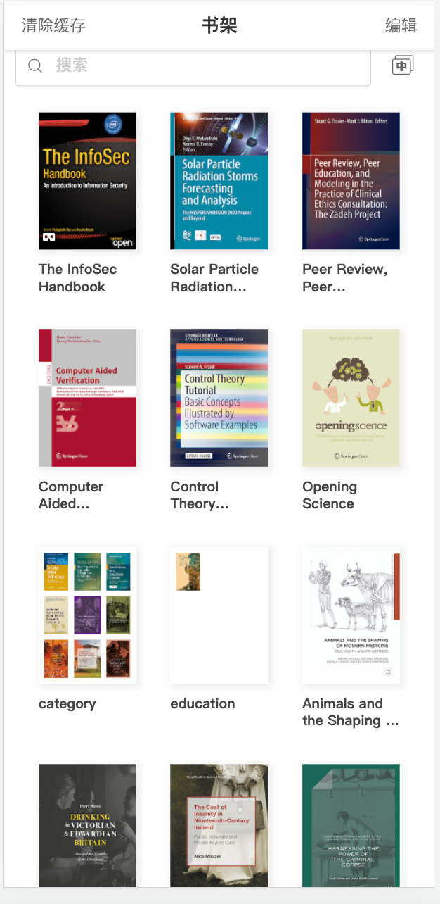
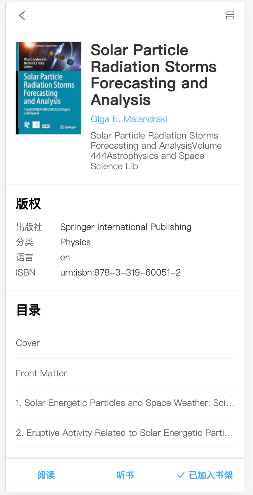
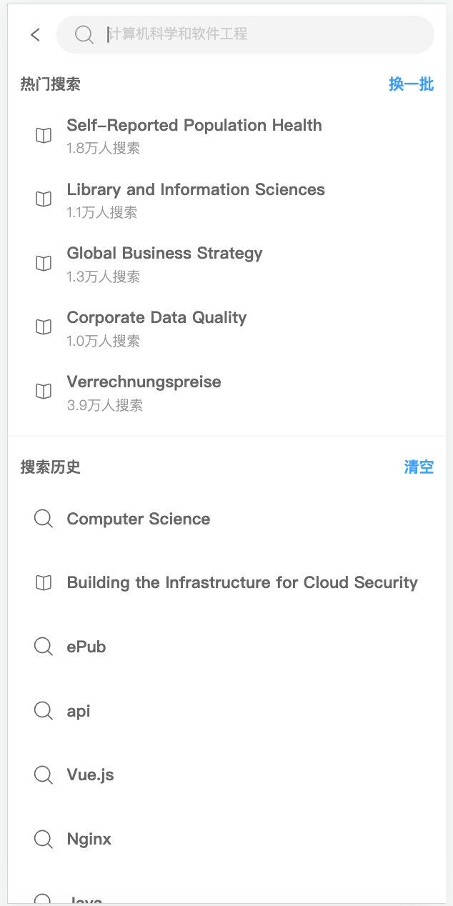
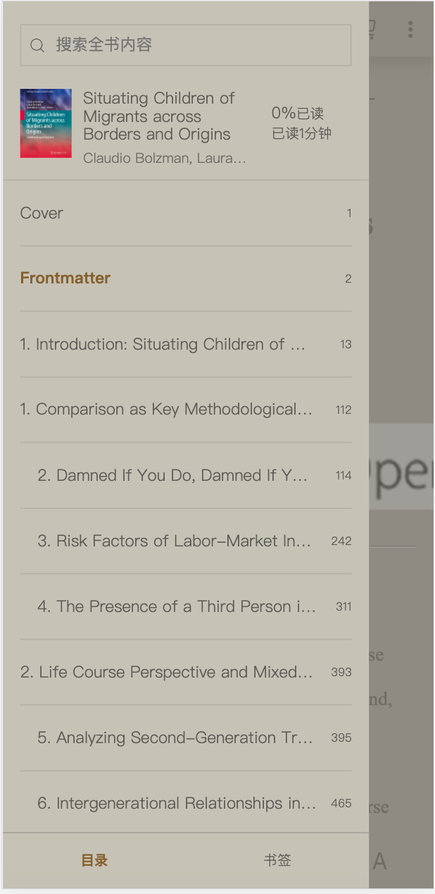
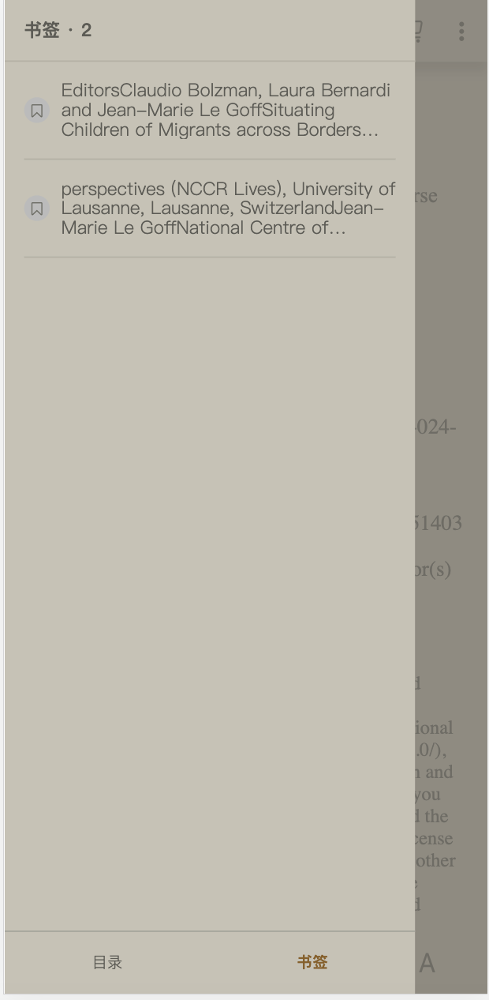
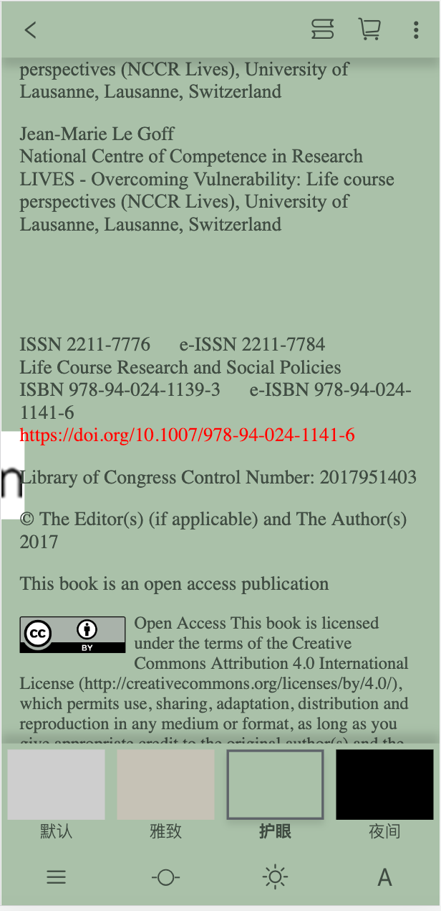
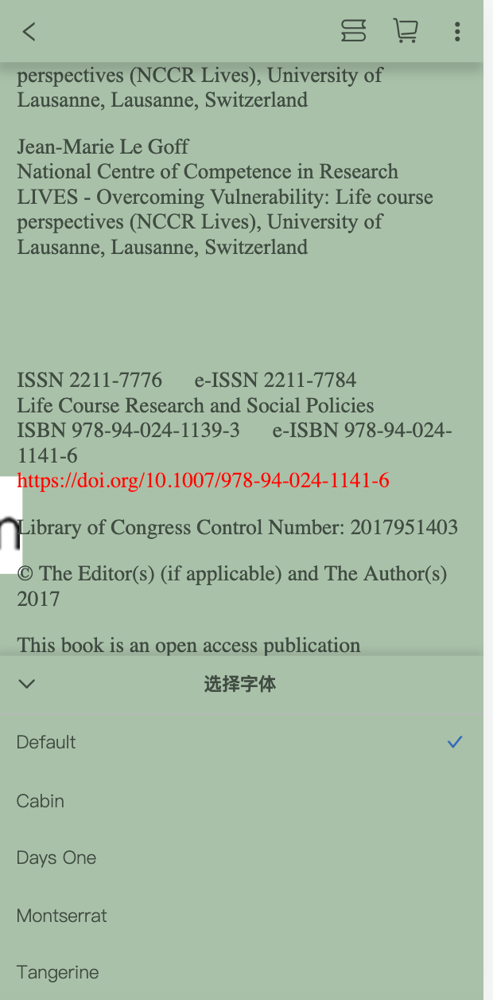
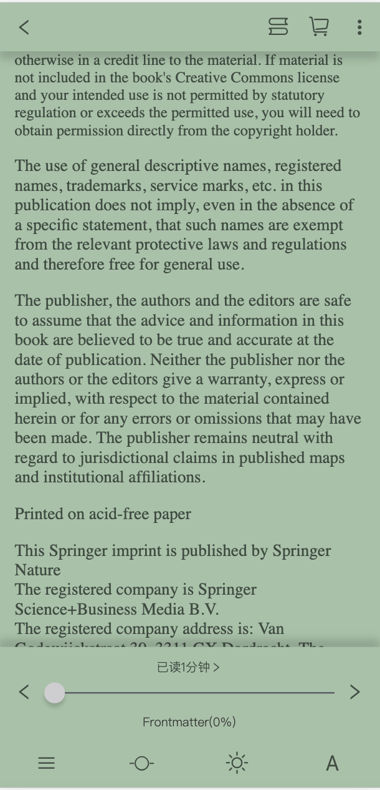

# 移动端书城

此版本为本地调试版本，使用webpack的devServer响应请求并模拟数据，资源用nginx服务器请求。

（如果不想使用devServer,可以在vue.config.js中删掉before函数以及相关代码，然后在项目的入口文件main.js 中导入Mock/index.js）


## 使用方法

- 配置nginx代理服务器，监听本项目的资源端口为8081，同时设置**允许跨域**。（如果指定另外的端口则需要自己修改.env文件）

  下表格中root路径为资源路径，需要将该参数修改为项目的静态资源在你电脑上的绝对路径

  - nginx的静态资源由于文件过大，没有上传到仓库中，请在issue中联系。

  ```c
  	server{
  		listen 8081;
  		server_name 127.0.0.1;
  		root /Users/jacksonma/Desktop/resource;
  		autoindex on;
  		location / {
  			add_header Access-Control-Allow-Origin *;
  		}
  		add_header Cache-Control "no-cache,must-revalidate";	
  	}
  ```

- 启动nginx

  - 浏览器输入http://127.0.0.1:8081/ 查看Nginx能否正常运行

- npm install

- npm run serve

- 浏览器打开 http://127.0.0.1:8080/ ，即可体验书城APP


注意：**node版本为v16.14.1 才能正常使用**


## 项目展示

### 书架




### 书籍详情页




### 听书


### 书城


### 书籍搜索




### 书籍分类


### 阅读器


### 目录




### 书签



### 主题切换



### 字体设置



### 阅读进度




## [Github](https://github.com/Panda-Ma/Mobile-Web-Bookstore)

⭐️
