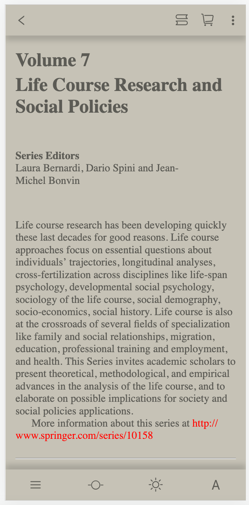

# 移动端书城


## 项目启动

```
npm install
```

### Compiles and hot-reloads for development
```
npm run serve
```

### Compiles and minifies for production
```
npm run build
```

### Customize configuration
See [Configuration Reference](https://cli.vuejs.org/config/).


## 书架


## 书籍详情页


## 听书


## 书城


### 书籍搜索


### 书籍分类


## 阅读器




### 目录


### 书签


### 主题切换


### 字体设置


### 阅读进度


